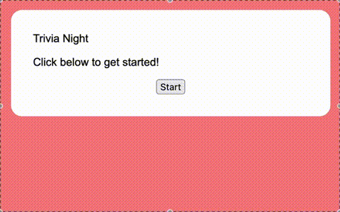

# Trivia

A simple Trivia app in TypeScript and React. This project uses the [Open Trivia DB API](https://opentdb.com/).

## How to run

In the project directory, run `npm install` then `npm start`.

Open [http://localhost:3000](http://localhost:3000) to view it in your browser.
